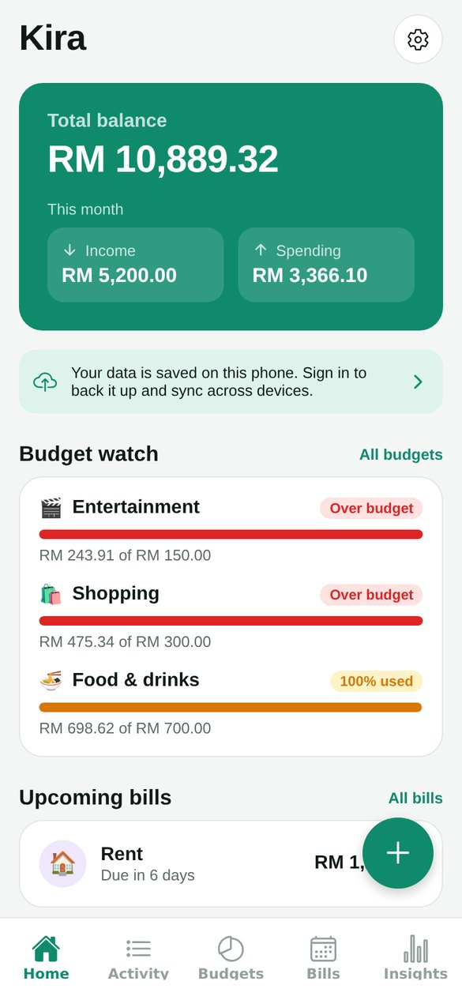
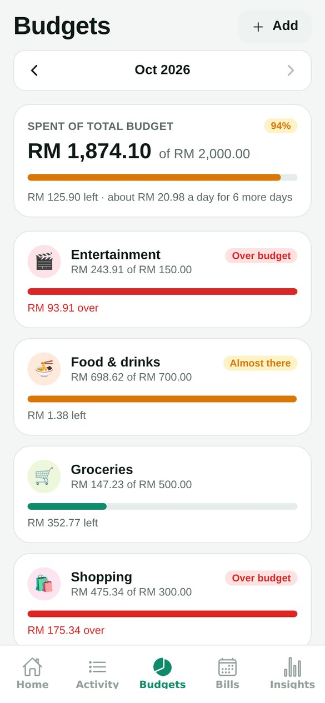
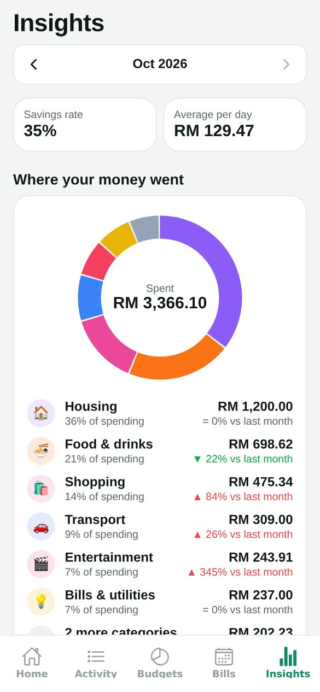
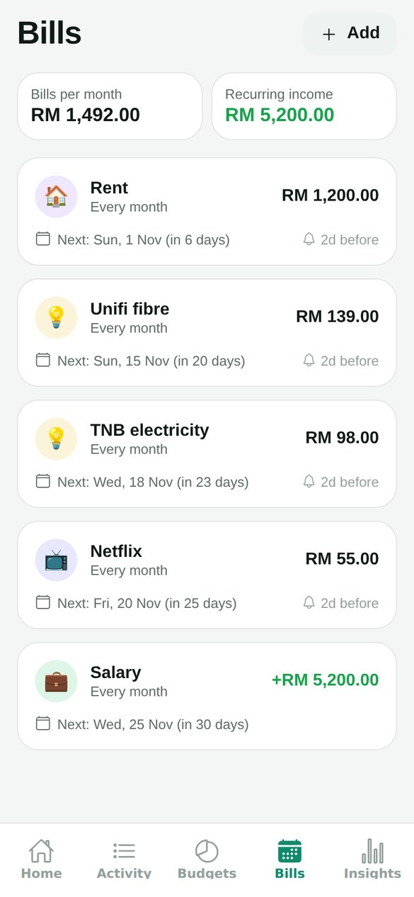
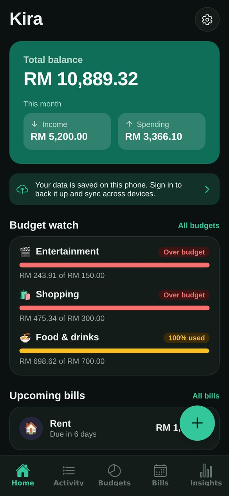
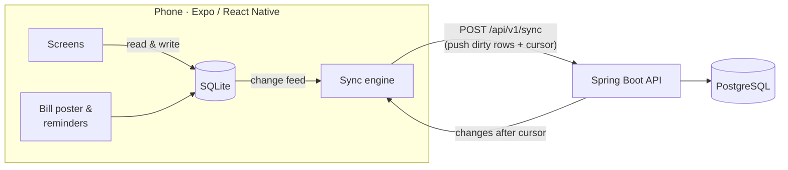

# Kira: offline-first personal finance


A mobile app for tracking spending, budgets and recurring bills, built with **React Native (Expo)** and a
**Spring Boot** sync API. Everything works offline: the app reads and writes a local SQLite database, and when
you sign in it syncs with the server in the background, so the same data shows up on all your devices.

*Kira* is Malay for "count" or "calculate".

**[⬇ Download the Android APK](https://github.com/amirizalrahmat0799/kira-finance/releases/latest)** · works offline out of the box; open Settings → Add sample data to explore.

| Home | Budgets | Insights | Bills | Dark mode |
|---|---|---|---|---|
|  |  |  |  |  |

## Features

- **Expenses and income** with categories (add your own, with an emoji and colour), accounts (cash, bank, e-wallet, credit card), dates and notes
- **Budgets** per category per month, with progress bars, "RM x a day left", and alerts when you pass **80%** and **100%** (in-app and as a notification)
- **Recurring bills and income** (weekly, monthly, yearly): recorded automatically on the due date, with a reminder notification 0–7 days before
- **Insights**: spending by category (donut chart), change versus last month, savings rate, average daily spend, and 6 months of income versus expenses
- **Works offline**, with optional sign-in to back up and sync across devices
- Light and dark mode, accessible labels, and sample data to try it out (Settings → Add sample data)

## Architecture



**Mobile:** Expo SDK 57, Expo Router, expo-sqlite, expo-notifications, expo-secure-store, react-native-svg (hand-built charts), TypeScript, Jest
**Backend:** Java 21, Spring Boot 3.5, Spring Security (JWT resource server), JdbcClient, Flyway, PostgreSQL, springdoc OpenAPI

## How sync works

The phone is the source of truth for the user; the server is a meeting point between devices.

1. **Ids are made on the phone** (random UUIDs), so rows can be created offline without clashing.
2. Every row carries `updatedAt` (the editing device's clock), a `deleted` tombstone flag, and locally a `dirty` flag.
3. A sync sends every dirty row plus the **cursor**, the highest server version the phone has seen.
4. The server upserts each row in one statement (`INSERT … ON CONFLICT DO UPDATE … WHERE`):
   - **last write wins**: an incoming row only replaces the stored one if it was edited later,
   - rows owned by another user can never be overwritten,
   - every accepted write takes a new number from a global `version` sequence.
5. It returns every row of that user with `version > cursor`, and the new cursor.
6. The phone applies them unless it has a newer unsent edit, and clears `dirty` only on rows that didn't change while
   the request was in flight.

Two details that are easy to get wrong:

- **Missed updates.** Version numbers are handed out when a transaction writes, but transactions can commit out of order.
  A reader could move its cursor past version 11 while version 10 is still uncommitted, and never see 10. Since only a
  user's own syncs write their rows, the server takes a **per-user advisory lock** (`pg_advisory_xact_lock`) for the
  sync, which serialises exactly the writes that matter.
- **Duplicate bills.** If two phones are both offline on rent day, each would record the rent. Instead, the id of a bill's
  transaction is a **deterministic UUID (v5 style) from the rule id and the due date**, so both phones create the *same*
  row and sync merges them. Deleting one of these transactions leaves a tombstone, so it isn't recreated.

Money is stored as integers in **sen** end to end (`RM 12.50` is `1250`), with no floating point.

## Auth

- `POST /api/v1/auth/register` and `/login` return a short-lived **JWT access token** (15 minutes, HS256) and a
  **refresh token** (30 days).
- Refresh tokens are random 256-bit values stored only as a SHA-256 hash, and **rotate on every use**. Presenting an
  already-used refresh token means it was copied, so the whole sign-in (the token family) is revoked.
- Passwords use BCrypt; a login for an unknown email still runs a BCrypt check, so it takes as long as a wrong password.
- On the phone, tokens are kept in the OS keychain / keystore (expo-secure-store).
- `DELETE /api/v1/me` deletes the account and all synced data.

Errors are RFC 9457 problem details (`{ status, title, detail }`), and the app shows `detail` directly.
API docs: **http://localhost:8080/docs** (Swagger UI).

## Running it

### 1. The app on your phone (no server needed)

```bash
cd mobile
npm install
npx expo start
```

Scan the QR code with **Expo Go** (Android) or the Camera app (iOS). Open Settings → **Add sample data** to explore.

### 2. The sync server

```bash
docker compose up --build        # PostgreSQL + API on http://localhost:8080
```

In the app: Settings → **Sign in or create account**. On a phone, set **Server** to your computer's address on the
same Wi-Fi, for example `http://192.168.1.20:8080` (find it with `ipconfig` on Windows). You can also set it once with
`EXPO_PUBLIC_API_URL=http://192.168.1.20:8080 npx expo start`.

> Expo Go allows plain `http://` to your computer. A production build should talk to the API over HTTPS.

Or run the API from IntelliJ / Maven with a local database:

```bash
docker compose up -d db
cd backend && mvn spring-boot:run
```

### 3. Build an installable APK

Builds run in the cloud with [EAS Build](https://docs.expo.dev/build/introduction/), so no Android Studio is needed.

```bash
cd mobile
npx eas-cli@latest login               # free Expo account
npx eas-cli@latest build:configure     # first time only: links the project to your account
npx eas-cli@latest build -p android --profile preview
```

The `preview` profile in `eas.json` produces an `.apk` you can install directly (the default `.aab` is only for the
Play Store). Before building, set `EXPO_PUBLIC_API_URL` in that profile to your server's address; it becomes the default
on the sign-in screen. The APK allows plain `http://` (via `expo-build-properties`) so it can reach a server on your
Wi-Fi; a public deployment should use HTTPS instead.

## Tests

```bash
cd mobile && npm test && npm run typecheck && npm run lint
cd backend && mvn verify                       # unit tests
KIRA_TEST_DB_URL=jdbc:postgresql://localhost:5432/kira mvn verify   # + integration tests (needs the db container)
```

- **Mobile:** money parsing (no float rounding), dates and month maths, recurrence (31st → 28/29 Feb, leap years),
  budget thresholds (alert only when a threshold is *crossed*), insights, the conflict rule, and table ↔ SQLite ↔ JSON mapping.
- **Backend:** generated SQL, JWT issue/expiry, refresh-token hashing; and against real PostgreSQL: register/login,
  validation, refresh rotation and reuse detection, two-device sync, last-write-wins, tombstones, isolation between users,
  and account deletion. CI runs them with a PostgreSQL service container.

The same checks also run on a self-hosted Jenkins defined as code: see the [`Jenkinsfile`](Jenkinsfile) and
[jenkins-ci-lab](https://github.com/amirizalrahmat0799/jenkins-ci-lab).

## Project structure

```
mobile/
  src/app/           Screens (Expo Router): tabs, add/edit modals, settings, sign-in
  src/db/            SQLite schema & migrations, table descriptions, queries, change feed, sample data
  src/sync/          API client (token refresh), sync engine, conflict rule, SyncProvider
  src/services/      Recurring-bill posting, budget alerts, notifications (no-op on web)
  src/lib/           Pure logic: money, dates, recurrence, budgets, insights, ids (unit tested)
  src/ui/            Theme, components, charts, pickers
backend/
  src/main/java/com/kira/
    auth/            Register, login, refresh rotation, logout
    sync/            Sync endpoint, table descriptions, generated upsert / pull SQL
    user/            /me and account deletion
    config/          Security (JWT), CORS, OpenAPI, properties
  src/main/resources/db/migration/   Flyway schema
docker-compose.yml   PostgreSQL + API
```

## Roadmap

- Transfers between accounts
- Pull pagination for very large first syncs
- CSV import of bank statements
- Login rate limiting
- Shared budgets for households

## License

[MIT](LICENSE)
